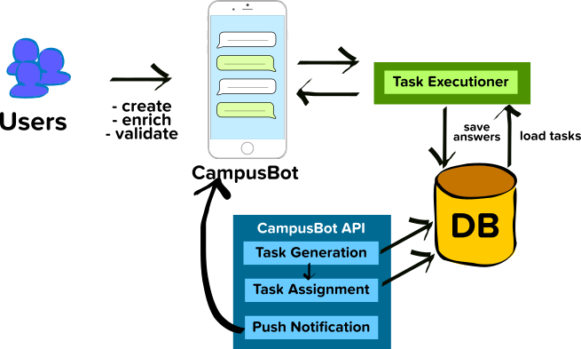

# campusbot



The CampusBot API repository: [https://github.com/enreina/campusbot-api](https://github.com/enreina/campusbot-api)

We use Google Firestore for our database. Exhaustive schema descriptions for each collection can be seen here: [CampusBot Database Structure](https://docs.google.com/document/d/13jITw5RtkcE60GvN-HtvoUBkVkW_MdHu_eqWAu7p5w4/edit?usp=sharing).

## Setting up telegram bot
Refer to [Telegram documentation](https://core.telegram.org/bots#6-botfather).

## Setting up campusbot-api
Before setting up the campusbot, you would need to run a local installation of the campusbot-api. Refer to the readme of [https://github.com/enreina/campusbot-api](https://github.com/enreina/campusbot-api/blob/master/README.md)

## Setting up firestore and firebase storage
Refer to https://firebase.google.com/docs/firestore/quickstart and https://firebase.google.com/docs/storage
Download your service account private key (https://firebase.google.com/docs/firestore/quickstart#initialize).

## How to Run (for development environment)
1. Clone the repo to your local directory, e.g:
```
git clone git@github.com:enreina/campusbot.git
```
2. Install python (if you haven't) along with `pip` and `virtualenv`

```
sudo apt-get install python2.7
sudo apt-get install python-pip python-dev build-essential 
sudo pip install --upgrade pip
sudo pip install --upgrade virtualenv 
```
3. Create and activate a python virtual environment
```
cd ~/campusbot-api
mkdir venv
virtualenv ./venv
source ./venv/bin/activate
```
4. Install requirements
```
pip install -r requirements.txt
```
5. Create a directory to store images of item temporarily
```
mkdir downloadedimages
```
6. Download [ngrok](https://ngrok.com/download) and extract the binary (if you haven't). You might need to make it executable:
```
chmod +x ngrok
```
7. Create an `.env` file (see `.env.sample`). You would need a Telegram bot API token and your Firestore json key.
```
nano .env
```
An example of .env file (replace the values accordingly)
```
PORT = 3000

TELEGRAM_BOT_TOKEN = '<your telegram bot token>'
NGROK_PATH = '[directory where you store the ngrok binary]'

FIRESTORE_SERVICE_ACCOUNT_PATH = '[full-path-to-your-service-account-private-key]'

IMAGE_DOWNLOAD_PATH = './downloadedimages'
IMAGE_URL_PREFIX = 'https://storage.googleapis.com/[name of your firebase storage bucket]/campusbot'

CAMPUSBOT_API_BASE_URL = 'http://[campusbot-api-ngrok-url]/api'
CAMPUSBOT_BASE_URL = 'https://[campusbot-api-ngrok-url]'
FIREBASE_STORAGE_BUCKET = "[name of your firebase storage bucket]"
```

4. Add execute permission to campusbot start
```
chmod +x campusbot-start
```
5. Run the chatbot `./start campusbot-start`

## How to Deploy (for production environment)
